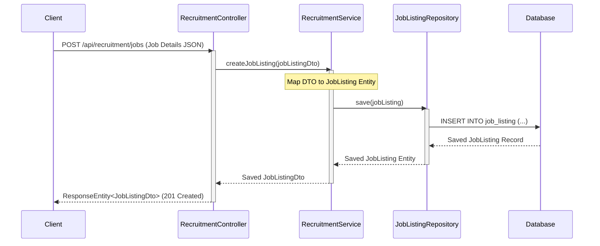
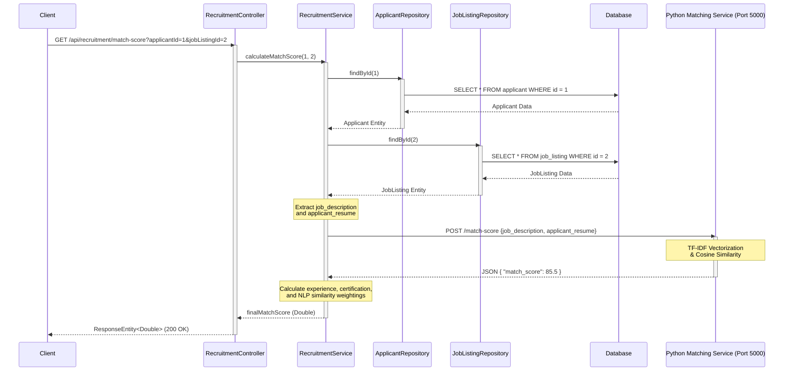

# Smart Recruiting System

A professional, high-performance recruiting and applicant matching system built on Spring Boot. This system provides APIs for filtering candidates, calculating application match scores, and performing bulk operations on applicant statuses.

---

## 1. Architecture Layout

The system follows a clean, layered architectural pattern mapping directly to standard Spring Boot conventions:

```text
smart-recruiting/
├── matching_service.py                # Python matching microservice (Flask/scikit-learn)
├── requirements.txt                   # Python dependencies configuration
└── src/main/java/com/recruitment/api/
    ├── SmartRecruitingApplication.java # Application entry point
    ├── controller/
    │   └── RecruitmentController.java  # REST Endpoints for client interaction
    ├── model/
    │   ├── Applicant.java              # JPA Entity representing candidates
    │   └── JobListing.java             # JPA Entity representing job postings
    ├── repository/
    │   ├── ApplicantRepository.java    # Data access layer for Applicant
    │   └── JobListingRepository.java   # Data access layer for JobListing
    └── service/
        └── RecruitmentService.java     # Core business logic orchestration
```

### Layer Responsibilities

*   **Python Matching Microservice (`matching_service.py`)**: A separate natural language processing service that performs job-resume text matching via TF-IDF and cosine similarity.
*   **Controller Layer (`controller/`)**: Exposes REST API endpoints and handles incoming HTTP requests/responses, payload validation, and HTTP routing.
*   **Model Layer (`model/`)**: Defines the core data entities and mappings to the relational database.
*   **Repository Layer (`repository/`)**: Abstracts database queries using Spring Data JPA. Includes custom query methods to retrieve applicants by job listings.
*   **Service Layer (`service/`)**: Houses business logic, validations, and workflows (e.g., filtering candidates, scoring, and status transitions).
*   **Application Bootstrapping (`SmartRecruitingApplication`)**: Initializes the Spring application context and autowiring.

---

## 2. Core Workflow

The typical path of data and logic execution flow within the service features two main execution workflows:

### A. Job Posting Workflow (Spring Boot Backend)

This workflow shows how a recruiter or client creates a new job listing in the system:



1.  **Request Entry**: The Client posts job details to `POST /api/recruitment/jobs` on `RecruitmentController`.
2.  **Service Delegation**: The Controller forwards the payload to `RecruitmentService.createJobListing`.
3.  **Entity Mapping**: The Service maps the incoming DTO parameters (e.g., job name, job description, minimum work experience, and required certifications) to a JPA `JobListing` entity.
4.  **Database Persistence**: The Service calls `JobListingRepository.save(jobListing)` to insert the job listing record into the `Database`.
5.  **Confirmation & Response**: The persisted entity is mapped back to a DTO and returned through the Controller with a `201 Created` status.

### B. Integrated Match Scoring (Spring Boot & Python Microservice)

This workflow shows the integration of the Spring Boot Java backend components and the Flask Python matching service during a match score calculation request:



1.  **Request Entry**: The Client requests a match score computation by hitting `GET /api/recruitment/match-score` on `RecruitmentController`.
2.  **Service Delegation**: The Controller invokes `calculateMatchScore` on `RecruitmentService`.
3.  **Data Fetching**: The Service retrieves the candidate profile via `ApplicantRepository` and the job criteria via `JobListingRepository` from the `Database`.
4.  **Microservice Integration**: The Service extracts the job description and candidate resume text fields and posts them as a JSON payload to the Flask-based **Python Matching Service** (`POST /match-score` on port 5000).
5.  **NLP Matching**: The Python service computes the cosine similarity of the TF-IDF representation of both texts, returning the `match_score` percentage.
6.  **Score Synthesis & Return**: The Service combines the NLP similarity score with other criteria (experience, certification status) to calculate the final score and passes it back to the Controller, which responds to the Client with `200 OK`.

---

## 3. Current Implementation Status

Here is the current implementation status of our core backend:

| Component | Status | Details |
| :--- | :--- | :--- |
| **Controller Endpoints** | `Blueprint` | RestController scaffolded with GET/POST endpoint blueprints awaiting controller logic mapping. |
| **Model Mapping** | `Active` | Complete JPA setup for `Applicant` and `JobListing` with H2/relational database mapping. |
| **Data Access** | `Active` | `ApplicantRepository` and `JobListingRepository` interfaces are active, including custom query methods like `findByJobListingId`. |
| **Application Filtering** | `Active` | Implemented in `RecruitmentService#filterApplications` using Java Streams. Filters applications by experience duration and required certifications in-memory. |
| **Match Score Engine** | `Active` | Calculates experience validation and certification weighting to compute scores. |
| **Bulk Updates** | `Active` | Complete transaction workflow to batch update candidate status fields. |

---

## 4. How to Run

### Prerequisites
*   **Java**: JDK 17 or higher
*   **Maven**: 3.8+

### Setup and Bootstrapping

1.  **Clone the Repository**:
    ```bash
    git clone https://github.com/hudezz/smart-recruiting.git
    cd smart-recruiting
    ```

2.  **Build the Project**:
    Use Maven to resolve dependencies and compile the source code:
    ```bash
    mvn clean compile
    ```

3.  **Run the Application**:
    Run the application using the Spring Boot Maven plugin:
    ```bash
    mvn spring-boot:run
    ```
    Alternatively, run the `main` method in `SmartRecruitingApplication.java`.

---

## 5. Python Matching Microservice

The system features a companion Python-based matching microservice (`matching_service.py`) that calculates the similarity score between a job description and an applicant's resume.

### Overview
This is a Flask-based microservice that calculates a similarity score between a job description and an applicant's resume.

### Machine Learning Approach
*   **TF-IDF (Term Frequency-Inverse Document Frequency) Vectorization**: Handled via scikit-learn's `TfidfVectorizer`.
*   **Cosine Similarity**: Measures the angle between the two resulting vectors to compute their alignment.

### Processing Pipeline
The matching pipeline converts textual data to a numerical match score using the following stages:

```text
Raw Text ──> TF-IDF Vectorization ──> Cosine Similarity Calculation ──> Percentage Match Score
             (English stop words      (Angle between vectors)          (0 - 100)
              removed)
```

1.  **Raw Text**: Accept raw string inputs for the job description and applicant resume.
2.  **TF-IDF Vectorization**: Perform vectorization with English stop words removed.
3.  **Cosine Similarity Calculation**: Calculate the cosine similarity between the job description and resume vectors.
4.  **Percentage Match Score**: Convert the similarity score to a percentage match score (0-100).

### API Contract

#### `POST /match-score`

*   **Request Body (JSON)**:
    ```json
    {
      "job_description": "string",
      "applicant_resume": "string"
    }
    ```
*   **Response Body (JSON)**:
    ```json
    {
      "match_score": 85.5
    }
    ```
    *Returns a `match_score` float (0-100).*

### Setup and Running

1.  **Create a Virtual Environment**:
    ```bash
    python3 -m venv venv
    source venv/bin/activate
    ```

2.  **Install Dependencies**:
    ```bash
    pip install -r requirements.txt
    ```

3.  **Run the Server**:
    ```bash
    python3 matching_service.py
    ```
    The server runs on port `5000` (e.g., `http://localhost:5000`).

