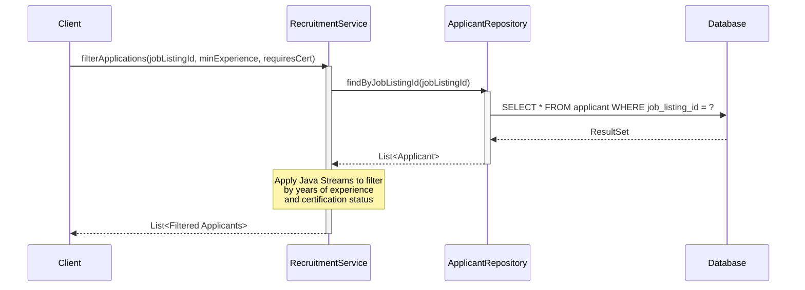

# Smart Recruiting System

A professional, high-performance recruiting and applicant matching system built on Spring Boot. This system provides APIs for filtering candidates, calculating application match scores, and performing bulk operations on applicant statuses.

---

## 1. Architecture Layout

The system follows a clean, layered architectural pattern mapping directly to standard Spring Boot conventions:

```text
src/main/java/com/recruitment/api/
├── SmartRecruitingApplication.java    # Application entry point
├── model/
│   ├── Applicant.java                 # JPA Entity representing candidates
│   └── JobListing.java                # JPA Entity representing job postings
├── repository/
│   ├── ApplicantRepository.java       # Data access layer for Applicant
│   └── JobListingRepository.java      # Data access layer for JobListing
└── service/
    └── RecruitmentService.java        # Core business logic orchestration
```

### Layer Responsibilities

*   **Model Layer (`model/`)**: Defines the core data entities and mappings to the relational database.
    *   `Applicant`: Represents candidate profiles containing contact information, work experience, certification status, and their linked job application.
    *   `JobListing`: Defines the criteria for a job position, including minimum required experience and certification status.
*   **Repository Layer (`repository/`)**: Abstracts databases queries using Spring Data JPA. Includes custom query methods to retrieve applicants by job listings.
*   **Service Layer (`service/`)**: Houses business logic, validations, and workflows (e.g., filtering candidates, scoring, and status transitions).
*   **Application Bootstrapping (`SmartRecruitingApplication`)**: Initializes the Spring application context and autowiring.

---

## 2. Core Workflow

The typical path of data and logic execution flow within the service is structured as follows:



1.  **Request Entry**: Client invokes the service layer methods.
2.  **Data Fetching**: The Service queries the Repositories using JPA methods to fetch the applicant and job listing contexts.
3.  **In-Memory Processing**: The Service performs business logic calculations, such as match scoring and stream-based filtering, without overloading the database with complex procedural logic.
4.  **State Synchronization**: Bulk changes and updates are saved back to the database through batch repository transactions.

---

## 3. Current Implementation Status

Here is the current implementation status of our core backend:

| Component | Status | Details |
| :--- | :--- | :--- |
| **Model Mapping** | `Active` | Complete JPA setup for `Applicant` and `JobListing` with H2/relational database mapping. |
| **Data Access** | `Active` | `ApplicantRepository` and `JobListingRepository` interfaces are active, including custom query methods like `findByJobListingId`. |
| **Application Filtering** | `Active` | Implemented in `RecruitmentService#filterApplications` using Java Streams. Filters applications by experience duration and required certifications in-memory. |
| **Match Score Engine** | `Scaffolded` | Skeleton method signature created in `RecruitmentService#calculateMatchScore` with defined execution steps. |
| **Bulk Updates** | `Scaffolded` | Skeleton method signature created in `RecruitmentService#bulkUpdateCandidateStatuses` with transaction/saving steps. |

---

## 4. How to Run

### Prerequisites
*   **Java**: JDK 17 or higher
*   **Maven**: 3.8+

### Setup and Bootstrapping

1.  **Clone the Repository**:
    ```bash
    git clone https://github.com/hudezz/smart-recruiting.git
    cd smart-recruiting
    ```

2.  **Build the Project**:
    Use Maven to resolve dependencies and compile the source code:
    ```bash
    mvn clean compile
    ```

3.  **Run the Application**:
    Run the application using the Spring Boot Maven plugin:
    ```bash
    mvn spring-boot:run
    ```
    Alternatively, run the `main` method in `SmartRecruitingApplication.java`.
